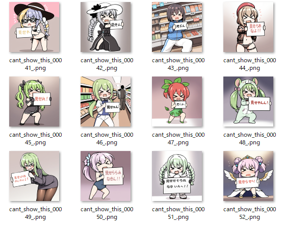
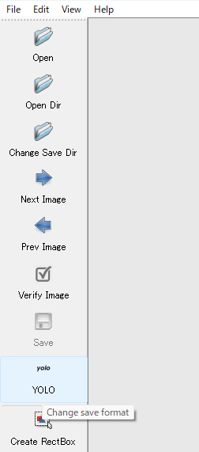
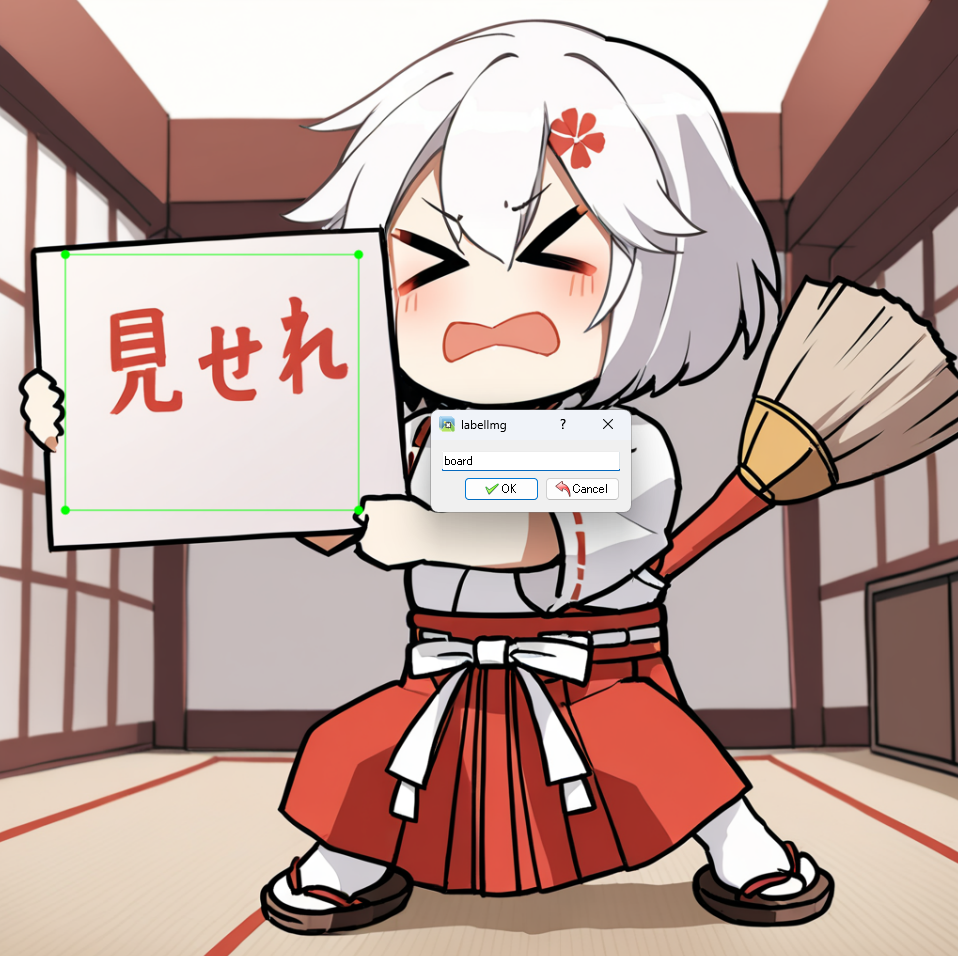
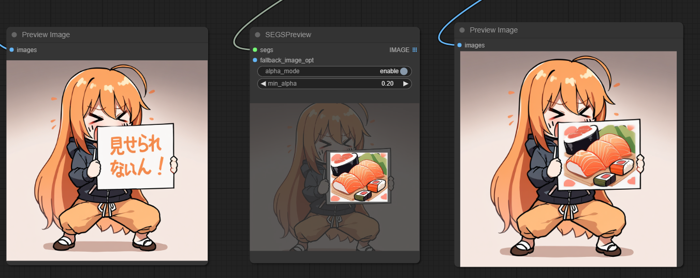

# YOLOモデルを作る
物体検出で使うための[ultralytics](https://docs.ultralytics.com/ja)のYOLOモデルを作成します。
作成したモデルは[Stable Diffusion web UI](https://github.com/AUTOMATIC1111/stable-diffusion-webui/)の[ADetailer](https://github.com/Bing-su/adetailer)や[ComfyUI](https://github.com/comfyanonymous/ComfyUI)の[ComfyUI-Impact-Pack](https://github.com/ltdrdata/ComfyUI-Impact-Pack/)などで利用することができます。

## 手順
今回は、以下のLoRAで生成した画像の看板の部分を検出するモデルを作っていきます。
- [Can't show this \(meme\) SDXL \- v1\.0 \| Stable Diffusion LoRA \| Civitai](https://civitai.com/models/293531)

### Step1. 素材を集める
[Wildcard](https://github.com/ltdrdata/ComfyUI-extension-tutorials/blob/Main/ComfyUI-Impact-Pack/tutorial/ImpactWildcard.md)などを駆使して100枚程度画像を生成します。  
ワークフロー例 : [step1_cant_show_this.png](workflow/step1_cant_show_this.png)  
  

### Step2. 作業フォルダの作成
[workspace](workspace/)内に作業フォルダを作成し、その中に `images` と `labels` フォルダを作成します。
```
mkdir workspace/<適当な名前>
cd workspace/<適当な名前>
mkdir images && mkdir labels
```
  
Step1で生成した画像を、先ほど作成した作業フォルダ内の `images` フォルダに配置します。  
この時のフォルダ構成は以下のようになります。
```
workspace/
`-- cant_show_this
    |-- images
    |   |-- cant_show_this_00001_.png
    |   |-- cant_show_this_00002_.png
    |   |-- cant_show_this_00003_.png
...
    |   |-- cant_show_this_00098_.png
    |   |-- cant_show_this_00099_.png
    |   `-- cant_show_this_00100_.png
    `-- labels

3 directories, 100 files
```

### Step3. 環境構築
ラベル付けや学習の環境構築を行います。
```
# venv仮想環境の作成
python -m venv venv
# 作成した仮想環境の有効化 (環境によってコマンドが異なる)
. ./venv/Scripts/activate
# 必要なパッケージのインストール 
# (ultralyticsのバージョンは拡張機能で使っているバージョンに合わせたほうがいいかも)
pip install -r requirements.txt

# labelImgのバグ修正
# refer. https://github.com/HumanSignal/labelImg/issues/872#issuecomment-1402362685
patch -u venv/Lib/site-packages/labelImg/labelImg.py < patch/labelImg.patch
patch -u venv/Lib/site-packages/libs/canvas.py < patch/canvas.patch
```

### Step4. ラベル付け
Step3で作成した仮想環境上で以下のコマンドを実行してlabelImgを起動します。
```
labelImg
```

#### 前準備
1. 「Open Dir」ボタンを押し、Step2で作成した生成画像の配置先フォルダ `images` を指定します。  
2. 「Change Save Dir」ボタンを押し、Step2で作成したフォルダ `labels` を指定します。  
3. ラベルデータの保存形式を「YOLO」に変更します。  


#### ラベル付け
1. 「Create RectBox」ボタン（またはWキー）を押してラベル付けを開始します。
2. 検出したい範囲をドラッグで指定し、適当なラベル名を付けます。

3. 「Save」ボタン（またはCtrl+S）を押して保存します。
4. 「Next Image」ボタン（またはDキー）を押して次の画像を表示します。
  
すべての画像のラベル付けが終わったら、 `labels` フォルダにtxtファイルがあることを確認します。  
この時のフォルダ構成は以下のようになります。
```
workspace/
`-- cant_show_this
    |-- images
    |   |-- cant_show_this_00001_.png
    |   |-- cant_show_this_00002_.png
    |   |-- cant_show_this_00003_.png
(中略)
    `-- labels
        |-- cant_show_this_00001_.txt
        |-- cant_show_this_00002_.txt
        |-- cant_show_this_00003_.txt
(中略)
        |-- cant_show_this_00098_.txt
        |-- cant_show_this_00099_.txt
        |-- cant_show_this_00100_.txt
        `-- classes.txt

3 directories, 201 files
```

### Step5. 学習の事前準備
#### 設定ファイルの作成
Step2で作成した作業フォルダ内にYAMLファイルを作成します。
```
cp dataset.yaml.example workspace/<Step2で作成した作業フォルダ>/dataset.yaml
```
  
作成した dataset.yml を以下のように変更します。
- 2行目の `path` を作業フォルダのパスに変更。
- 8行目の `board` をStep4のラベル付けで指定したラベル名に変更。  

#### データセットの配置
Step4でラベル付けした画像とラベル（テキストファイル）を訓練データと検証データに分けます。  
訓練データと検証データを配置するためのフォルダを作成します。
```
cd workspace/<Step2で作成した作業フォルダ>/
mkdir -p train/{images,labels}
mkdir -p val/{images,labels}
```

一旦、画像とラベルを訓練データフォルダ `train` に移動させます。
```
mv images/ train/
mv labels/ train/
```

訓練データフォルダ内の画像とラベルの一部を検証データフォルダ `val` に移動させます。  
また、 `train/labels/classes.txt` も `val/labels` に移動させておきます。
件数は訓練データの半分(33件)くらいにしています。  
この時のフォルダ構成は以下のようになります。
```
workspace/
`-- cant_show_this
    |-- dataset.yaml
    |-- train
    |   |-- images
    |   |   |-- cant_show_this_00001_.png
    |   |   |-- cant_show_this_00002_.png
    |   |   |-- cant_show_this_00003_.png
(中略)
    |   |   |-- cant_show_this_00065_.png
    |   |   |-- cant_show_this_00066_.png
    |   |   `-- cant_show_this_00067_.png
    |   `-- labels
    |       |-- cant_show_this_00001_.txt
    |       |-- cant_show_this_00002_.txt
    |       |-- cant_show_this_00003_.txt
(中略)
    |       |-- cant_show_this_00065_.txt
    |       |-- cant_show_this_00066_.txt
    |       |-- cant_show_this_00067_.txt
    |       `-- classes.txt
    `-- val
        |-- images
        |   |-- cant_show_this_00068_.png
        |   |-- cant_show_this_00069_.png
        |   |-- cant_show_this_00070_.png
(中略)
        |   |-- cant_show_this_00098_.png
        |   |-- cant_show_this_00099_.png
        |   `-- cant_show_this_00100_.png
        `-- labels
            |-- cant_show_this_00068_.txt
            |-- cant_show_this_00069_.txt
            |-- cant_show_this_00070_.txt
(中略)
            |-- cant_show_this_00098_.txt
            |-- cant_show_this_00099_.txt
            |-- cant_show_this_00100_.txt
            `-- classes.txt

7 directories, 203 files
```


### Step6. 学習
作業フォルダに移動します。
```
cd workspace/<Step2で作成した作業フォルダ>/
```

以下のコマンドを実行して学習します。
```
yolo task=detect mode=train model=yolov8n.pt data=dataset.yaml epochs=300 imgsz=1024
```

GPUを使いたい場合は、GPU版のtorchをインストールしなおして、実行します。
```
pip uninstall torch torchvision
pip install torch torchvision torchaudio --index-url https://download.pytorch.org/whl/cu118
yolo task=detect mode=train model=yolov8n.pt data=dataset.yaml epochs=300 imgsz=1024 device=0
```

学習が終わると `runs` フォルダ内に学習結果やモデルが作成されます。
```
runs/
`-- detect
    `-- train
        |-- F1_curve.png
        |-- PR_curve.png
        |-- P_curve.png
        |-- R_curve.png
        |-- args.yaml
        |-- confusion_matrix.png
        |-- confusion_matrix_normalized.png
        |-- labels.jpg
        |-- labels_correlogram.jpg
        |-- results.csv
        |-- results.png
        |-- train_batch0.jpg
        |-- train_batch1.jpg
        |-- train_batch2.jpg
        |-- val_batch0_labels.jpg
        |-- val_batch0_pred.jpg
        |-- val_batch1_labels.jpg
        |-- val_batch1_pred.jpg
        `-- weights
            |-- best.pt
            `-- last.pt

3 directories, 20 files
```

`best.pt` がYOLOモデルとなるので、コピーして適当な名前に変更します。
```
cp runs/detect/train/weights/best.pt cant_show_this.pt
```
  
YOLOモデルをモデルフォルダに配置します。
- ComfyUI-Impact-Pack(ComfyUI)の場合
  - `ComfyUI_windows_portable\ComfyUI\models\ultralytics\bbox`
  
ComfyUIのComfyUI-Impact-Packを使って動作確認してみます。  
ワークフロー例 : [step7_board_detailer.png](workflow/step7_board_detailer.png)  
実際に検出してくれました！  



## 参考ページ
- [YOLOv8を使って簡単に画像認識する \- ケムファク](https://chem-fac.com/yolov8/)
- [YOLOv7を使って自作データセットで物体検出してみた \| DevelopersIO](https://dev.classmethod.jp/articles/yolov7-train-with-customize-dataset/)
- [Yolo V8の覚書 \#Python \- Qiita](https://qiita.com/kotai2003/items/32329a90703394d39d5c)